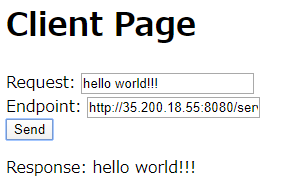

# gRPC-Web Sample

This sample is base on [official sample](https://github.com/grpc/grpc-web/tree/master/net/grpc/gateway/examples/helloworld).

```
[Browser]---<HTTP/2>---[envoy]---<gRPC>---[Server]
```

I make it a little complex, add some feature below:

- work on kubernetes
- add gRPC health check
- separate envoy route prefix
- use Vue.js for client
- build all images by Docker

## Try it now!

Please prepare Kubernetes cluster before you do this.

```
git clone https://github.com/zuiurs/grpc-web-sample.git
kubectl apply -f manifest/base.yaml
```

Check global IP of envoy, a web proxy.

```
$ kubectl get -n grpc-web-sample svc
NAME     TYPE           CLUSTER-IP      EXTERNAL-IP    PORT(S)          AGE
client   ClusterIP      10.117.10.187   <none>         8080/TCP         2d2h
envoy    LoadBalancer   10.117.13.18    35.200.18.55   8080:32202/TCP   2d1h <--- this
server   ClusterIP      10.117.9.154    <none>         8080/TCP         2d2h
```

You can access to the client page.

- http://[global-ip-of-envoy]:8080/client/index.html



## Modify it!

Build client and server images. NOTE: You have to change docker repository name in Makefile.

```
make client
make server
```

Generate protocol buffers files. This rule have some prerequisite.

- Install
  - `protoc`
  - `protoc-gen-go`
  - `protoc-gen-grpc-web`

```
make proto
```

## License

This software is released under the MIT License, see LICENSE.

## Author

Mizuki Urushida ([@zuiurs](https://twitter.com/zuiurs))
